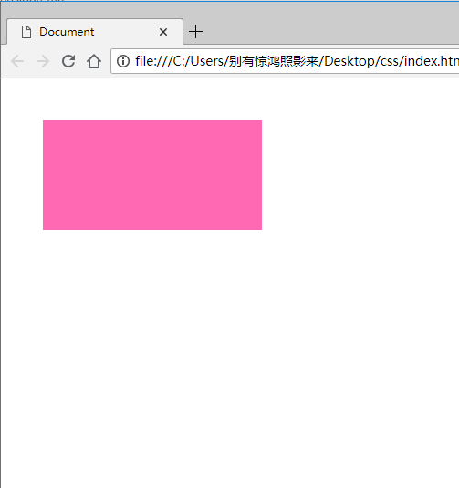
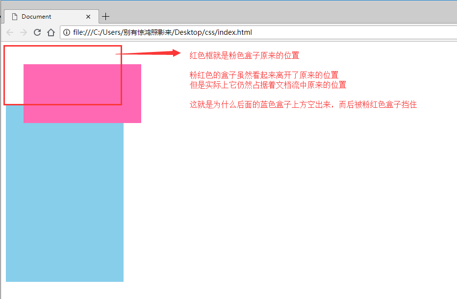
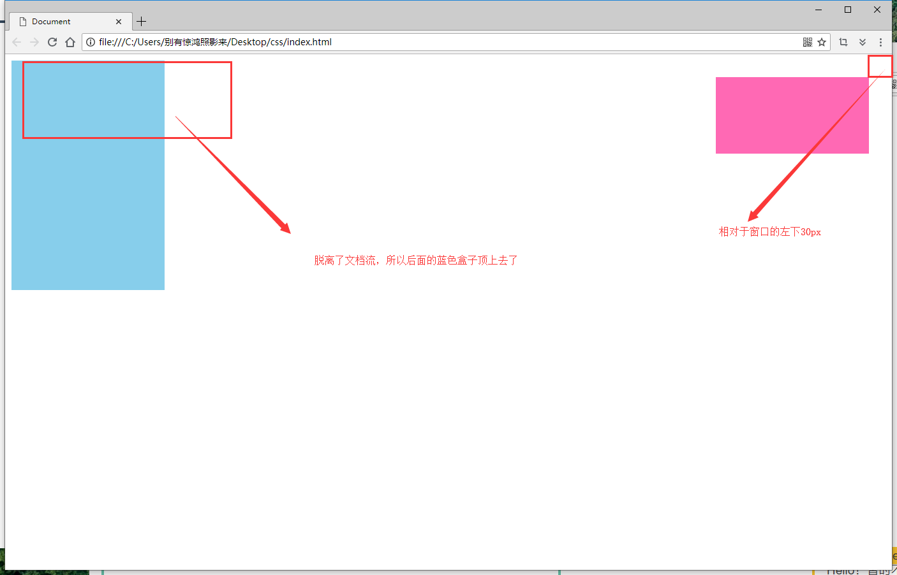

# position定位

### 关键词：

不脱离文档流：默认static，relative；

脱离文档流：fixed，absolute；

### position的四个值

------


* static 静止
* relative 相对
* fiexed 固定
* ==absolute== 绝对


### static 静止----默认值

------


> `static` 是默认值。任意 `position: static;` 的元素不会被特殊的定位。一个 static 元素表示它*不会被“positioned”*，一个 position 属性被设置为其他值的元素表示它*会被“positioned”*。


### relative 相对定位

------


> 1.`relative` 表现的和 `static` 一样，除非你添加了一些额外的属性。
>
> 2.在一个相对定位（position属性的值为relative）的元素上设置 `top`、 `right` 、 `bottom` 和 `left` 属性会使其偏离其正常位置。其他的元素的位置则不会受该元素的影响发生位置改变来弥补它偏离后剩下的空隙。

```css
.relative{
    /* 单独添加relative属性没有什么变化，因为没有偏移量 */
    position:relative;
    /*  */
    top: 20px;
    left: 30px;
}
```

效果如下：



#### 细节

> 1.``relative`相对定位不会脱离文档流，也就是说
>
> 

#### html代码：

``` html
<!DOCTYPE html>
<html lang="en">

<head>
    <meta charset="UTF-8">
    <meta name="viewport" content="width=device-width, initial-scale=1.0">
    <meta http-equiv="X-UA-Compatible" content="ie=edge">
    <title>Document</title>
    <style>
        .relative{
            position: relative;
            top: 30px;
            left: 30px;
            width: 200px;
            height: 100px;
            background-color: hotpink;
        }
        .box{
            width: 200px;
            height: 300px;
            background-color: skyblue;
        }
    </style>
</head>

<body>
    <div class="relative"></div>
    <div class="box"></div>
</body>

</html>
```


### fixed ---- 固定定位

------

> 一个固定定位（position属性的值为fixed）元素会相对于视窗来定位，这意味着即便页面滚动，它还是会停留在相同的位置。和 `relative` 一样， `top` 、 `right` 、 `bottom` 和 `left` 属性都可用。

> 注意：一个固定定位元素不会保留它原本在页面应有的空隙（脱离文档流）。
>
> 

#### html：代码

``` html
<!DOCTYPE html>
<html lang="en">

<head>
    <meta charset="UTF-8">
    <meta name="viewport" content="width=device-width, initial-scale=1.0">
    <meta http-equiv="X-UA-Compatible" content="ie=edge">
    <title>Document</title>
    <style>
        .fixed{
            position: fixed;
            top: 30px;
            right: 30px;
            width: 200px;
            height: 100px;
            background-color: hotpink;
        }
        .box{
            width: 200px;
            height: 300px;
            background-color: skyblue;
        }
    </style>
</head>

<body>
    <div class="fixed"></div>
    <div class="box"></div>
</body>

</html>
```


### absolute ---- 绝对定位

``` html	
<!DOCTYPE html>
<html lang="en">

<head>
    <meta charset="UTF-8">
    <meta name="viewport" content="width=device-width, initial-scale=1.0">
    <meta http-equiv="X-UA-Compatible" content="ie=edge">
    <title>Document</title>
    <style>
        .absolute{
            position: absolute;
            top: 30px;
            left: 30px;
            width: 500px;
            height: 500px;
            background-color: hotpink;
        }
        .box{
            position: absolute;
            top: 50%;
            left: 50%;
            margin-top: -50px;
            margin-left: -50px;
            width: 100px;
            height: 100px;
            background-color: #fff;
        }
    </style>
</head>

<body>
    <div class="absolute">
        <div class="box"></div>
    </div>
</body>

</html>
```


> 1.设定为绝对定位的盒子，会向上找使用过定位的祖先元素来定位，如果没有，就会相对于html来定位，所以，可以在需要进行绝对定位的元素的父元素添加`position: relative`.

### z-index

> z-index:数字，用于指定层级，数字越大，层级越高，越不容易被遮挡。