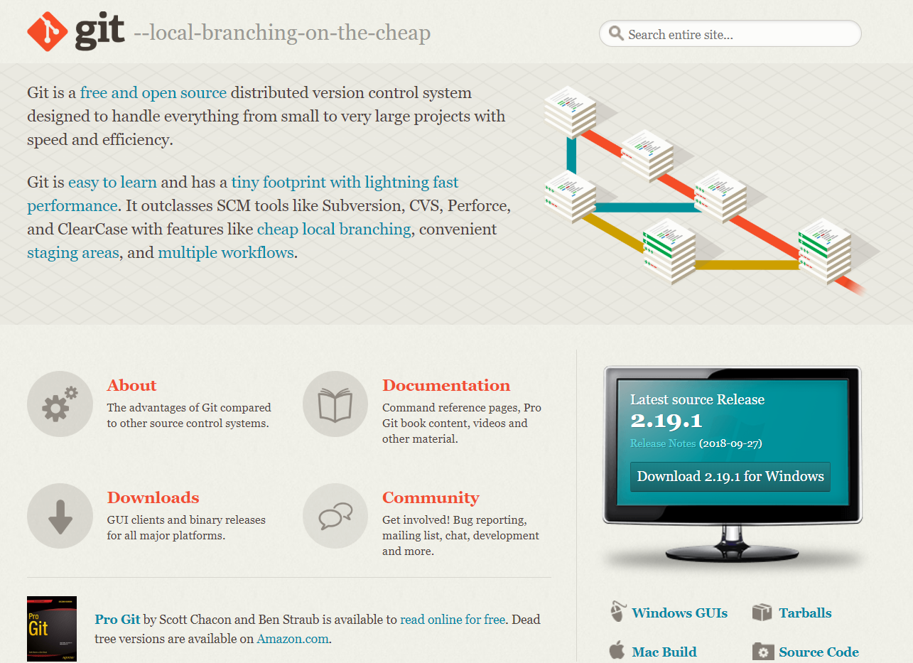
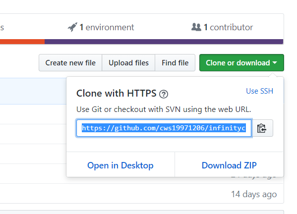
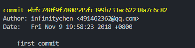

# Git教程

## A - 安装

打开`Git官网`获取对应操作系统的Git程序




链接地址：[Git官网](https://git-scm.com/)


直接点下一步进行安装


## B - 基本配置

### 01.查看git版本号


```linux
git --version
```


### 02.配置用户名和邮箱


```linux
//用户名
git config --global user.name "用户名"
//邮箱
git config --global user.email "邮箱"
```


### 03.查看当前配置的用户名

```
git config --list
```


## C - 创建仓库


>   仓库（Repository）：Git里把项目称作仓库，本质就是包含代码的目录


### 01.初始化（创建）仓库


初始化目录会在目录下生成子目录`.git`，默认隐藏，不要对其做修改。


a.在当前目录下输入

```
git init
```


b.在后面指定要初始化的目录

```
git init 目录地址
```


c.在`git clone`后面输入链接

```
git clone https://github.com/cws19971206/infinitychen.git （可选修改项目名字）
```



这样 git 会把这个仓库下载下来


## D - 基本用法

### 01.查看仓库基本状态

```
git status
```


### 02.提交文件到暂存区

```
//提交 当前目录下的所有文件到暂存区
git add .

//提交单个文件到站暂存区
git add readme.txt

```


### 03.提交版本

每次提交都会生成一个节点信息；例如：




`conmit`后面的`ebfc740f9f7800545fc399b733ac62238a7c6c82`就是节点id

而`first commit`就是提交时的填写在`-m` 后面的描述

上面有记载提交时间，提交人


```
git commit -m "这次版本提交的描述"
```


### 04.查看版本日志

```
//查看版本日志
git log
//查看添加的详细内容
```


### 05.回到某个版本节点

```
git checkout 版本id
```


## E - 三种状态


a. modified --- 已修改

b. staged --- 已暂存

c. committed ---已提交


## F - 远程仓库

### 01.添加远程仓库

```
git remote add 远程名称 远程地址
git remote add github https://github.com/cws19971206/infinitychen
```


查看当前的远程仓库：

```
git remote
```


### 02.上传代码

```
git push -u 远程名 分支名
git push -u github master
```

